# ใบงานปฏิบัติสัปดาห์ที่ 8: Local Database & Persistence ด้วย Drift

**วิชา** การพัฒนาซอฟต์แวร์สำหรับอุปกรณ์เคลื่อนที่ | **เครื่องมือ** Flutter, Drift, sqlite3_flutter_libs, build_runner, Google AI Studio

> 🔗 **ความต่อเนื่องของโปรเจกต์:** ใบงานนี้สืบทอดโดยตรงจากโปรเจกต์ **`campus_marketplace_w7`** ที่ทำไว้จนจบใบงานการทดลองที่ 7 ตอนนี้โปรเจกต์มี: หน้า **Home** ที่ดึงสินค้าจริงจาก Fake Store API (สัปดาห์ 6), ตะกร้าสินค้า (`CartModel`, สัปดาห์ 5), หน้า **"ลงประกาศขายสินค้า" (Sell)** ที่ใช้ Gemini Vision ช่วยแนะนำ title/category/description จากรูปภาพ (สัปดาห์ 7) และโครง **Bottom Navigation Bar** (`MainScaffold`) ที่มี 2 Tab แรกคือ "หน้าหลัก" กับ "ลงประกาศขาย"  **ยังไม่มี** ฟีเจอร์ "ถูกใจ" (Favorites) และร่างประกาศที่ AI ช่วยแนะนำ หลังกดยืนยันจะถูกเก็บไว้ใน State ชั่วคราวของ `SellItemPage` เท่านั้น **หายไปทันทีที่ปิดแอป**
>
> สัปดาห์นี้คือจุดที่ฟีเจอร์ **"รายการโปรด" (Favorites) ถูกสร้างขึ้น** พร้อมกันกับการนำร่างประกาศมาบันทึกถาวร ทั้งสองฟีเจอร์จะเข้าถึงข้อมูลผ่าน **Repository Pattern** เช่นเดียวกับที่ `ItemRepository`/`ItemRepositoryApi` ทำกับ REST API ในสัปดาห์ที่ 6 **ทำต่อในโฟลเดอร์ `campus_marketplace_w7` เดิม ห้ามสร้างโปรเจกต์ใหม่แยกต่างหาก** 

---

## วัตถุประสงค์การเรียนรู้

เมื่อทำใบงานนี้เสร็จสิ้น ผู้เรียนจะสามารถ

1. ใช้ AI ช่วยร่างโครงสร้างตาราง (Schema) จากคำอธิบายฟีเจอร์เป็นภาษาธรรมชาติ แล้วประเมิน/ปรับแก้ด้วยตนเอง
2. ติดตั้งและตั้งค่า Drift พร้อมรัน Code Generation ด้วย `build_runner` ได้ถูกต้อง
3. ประกาศตาราง (`Table`) และคลาสฐานข้อมูล (`AppDatabase`) ตามหลักการที่เรียนในบทหนังสือเรียนหัวข้อ 8.4
4. ออกแบบและเขียน Repository Pattern (Interface + Implementation) สำหรับ Local Database เองได้ โดยไม่ต้องมีตัวอย่างสำเร็จรูปครบทุกเมธอด
5. สร้างฟีเจอร์ "ถูกใจ" (Favorites) และนำร่างประกาศขายสินค้าจากสัปดาห์ที่ 7 มาบันทึกถาวรด้วย Drift ได้จริง
6. เพิ่ม Tab ใหม่เข้า Bottom Navigation Bar (`MainScaffold`) ที่มีอยู่แล้วได้ โดยไม่กระทบโค้ดของ Tab เดิม
7. ทดสอบและยืนยันว่าแอปทำงานแบบ Offline-first ได้จริง คือข้อมูลไม่หายแม้ปิดแอปหรือปิดอินเทอร์เน็ต

## สิ่งที่ต้องเตรียมก่อนเริ่ม

- โปรเจกต์ `campus_marketplace_w7` จากใบงานการทดลองที่ 7 ที่รันได้ปกติครบทุก Checkpoint แล้ว (มีหน้า Home, Checkout, Sell พร้อม `MainScaffold` 2 Tab)
- บัญชี Google AI Studio ที่ใช้มาตั้งแต่สัปดาห์ที่ 1
- ติดตั้ง Flutter SDK เวอร์ชันล่าสุดที่รองรับ Null Safety เต็มรูปแบบ (ตรวจสอบด้วย `flutter --version`)

⚠️ **ข้อควรระวัง**: การเปลี่ยนโครงสร้างตาราง (เพิ่ม/ลบ/แก้ไขคอลัมน์) หลังรัน `build_runner` ไปแล้วครั้งหนึ่ง ต้องรันคำสั่งเดิมซ้ำทุกครั้ง มิเช่นนั้นไฟล์ `.g.dart` จะไม่ตรงกับโค้ดล่าสุดและโปรเจกต์จะไม่คอมไพล์ผ่าน หากเจอปัญหานี้ให้ดูหัวข้อ Troubleshooting ท้ายใบงาน

---

## ส่วนที่ 1: ใช้ AI ช่วยร่าง Schema ก่อนเขียนโค้ด

ตามหลักการในบทหนังสือเรียนหัวข้อ 8.3 การออกแบบ Schema ต้องทำก่อนเขียนโค้ดเสมอ สัปดาห์นี้จะฝึกใช้ Gemini ช่วยร่าง Schema เบื้องต้น แล้วนำมาตรวจสอบและปรับแก้ด้วยตนเอง เพราะ AI ช่วยคิดได้เร็ว แต่การตัดสินใจสุดท้ายต้องเป็นของนักพัฒนาเสมอ (หลักการเดียวกับที่เรียนเรื่อง Responsible AI ในสัปดาห์ที่ 7)

### ขั้นตอนที่ 1.1 🔧 ทำตามขั้นตอน

เปิด Google AI Studio (https://aistudio.google.com) แล้วส่ง Prompt นี้ให้ Gemini

```
ฉันกำลังพัฒนาแอป Flutter ชื่อ Campus Marketplace ด้วย Drift (ORM สำหรับ SQLite)
ต้องการออกแบบตารางสองตาราง

1. เก็บรายการสินค้าที่ผู้ใช้กดถูกใจเป็นครั้งแรก 
   ต้องรู้ว่าถูกใจสินค้าชิ้นไหน (อ้างอิงจาก id สินค้าที่เป็นตัวเลข)
   เก็บชื่อ ราคา รูปภาพไว้ด้วยเพื่อแสดงผลได้โดยไม่ต้องเรียก API ซ้ำ และต้องเรียงตามเวลาที่กดถูกใจล่าสุดได้

2. เก็บร่างประกาศขายสินค้าที่ AI ช่วยแนะนำจากรูปภาพ (ปัจจุบันเก็บไว้ใน State ชั่วคราวเท่านั้น หายเมื่อปิดแอป)
   มีชื่อประกาศ หมวดหมู่ คำบรรยาย และ path ของรูปภาพในเครื่อง ต้องรู้ว่าแก้ไขล่าสุดเมื่อไหร่

ช่วยร่างโค้ด Dart ของ Class ที่ extends Table ทั้งสองตาราง พร้อมระบุชนิดข้อมูล (Column type)
ของแต่ละคอลัมน์ และเหตุผลว่าทำไมเลือกชนิดข้อมูลนั้น
```

บันทึกโค้ดที่ Gemini ตอบกลับมาที่ด้านล่าง

ส่ง Prompt ใน Google AI Studio (Gemini 3.8 Flash) โค้ดที่ Gemini ตอบกลับมา

```dart
import 'package:drift/drift.dart';

class FavoriteProducts extends Table {
  // รหัสสินค้าจาก Backend
  IntColumn get productId => integer()();

  // ชื่อสินค้า
  TextColumn get title => text()();

  // ราคาสินค้า
  RealColumn get price => real()();

  // URL หรือ Path รูปภาพ
  TextColumn get imageUrl => text()();

  // วันและเวลาที่กดถูกใจ
  DateTimeColumn get likedAt => dateTime().withDefault(currentDateAndTime)();

  // กำหนดให้ productId เป็น Primary Key ป้องกันการกดซ้ำ
  @override
  Set<Column> get primaryKey => {productId};
}

class ProductDrafts extends Table {
  // Primary key รันอัตโนมัติภายในเครื่อง
  IntColumn get id => integer().autoIncrement()();

  // ชื่อประกาศ (AI แนะนำ หรือผู้ใช้แก้)
  TextColumn get title => text().nullable()();

  // หมวดหมู่สินค้า
  TextColumn get category => text().nullable()();

  // คำบรรยายสินค้า
  TextColumn get description => text().nullable()();

  // ที่อยู่ไฟล์รูปภาพในเครื่อง
  TextColumn get localImagePath => text()();

  // เวลาที่แก้ไขร่างล่าสุด
  DateTimeColumn get updatedAt => dateTime().withDefault(currentDateAndTime)();
}
```

เหตุผลที่ Gemini ให้มา (สรุป): `productId` เป็น Primary Key เพื่อกันการ Insert ซ้ำ, `price` ใช้ `RealColumn` เพราะราคามีทศนิยม, เก็บ `imageUrl` เป็นข้อความแทนการเก็บรูปทั้งไฟล์, `likedAt`/`updatedAt` ใช้ `DateTimeColumn` ไว้เรียงลำดับ และให้ `title`/`category`/`description` ของร่างเป็น `nullable()` เผื่อ AI ยังวิเคราะห์ไม่เสร็จหรือผู้ใช้ลบข้อความทิ้ง


### ขั้นตอนที่ 1.2: ตรวจสอบและเทียบกับหลักการในบทเรียน 🧠 คิดเอง

เปรียบเทียบ Schema ที่ได้จาก Gemini กับหลักการในบทเรียนหัวข้อ 8.3 แล้วตอบคำถามต่อไปนี้ โดยการสรุปตามความเข้าใจของตนเอง (ห้ามคัดลอกคำตอบจาก Gemini มาวางตรง ๆ)

- Gemini กำหนด Primary Key ให้แต่ละตารางถูกต้องหรือไม่ (ควรเป็น Auto-increment Integer ตามที่อธิบายในบทเรียน)
- คอลัมน์ราคาสินค้า Gemini เลือกชนิดข้อมูลใด ตรงกับที่บทเรียนแนะนำ (`RealColumn`/`double`) หรือไม่ หากไม่ตรง ให้แก้ไขเอง
- Gemini เสนอให้เก็บสำเนาข้อมูล (เช่น ชื่อ/ราคาสินค้า) ซ้ำไว้ในตาราง Favorites หรือแนะนำให้เก็บแค่ `itemId` แล้วไปเรียก API ใหม่ทุกครั้ง หากแนะนำแบบหลัง ให้อธิบายตามหลักการ Offline-first ในบทหนังสือเรียนหัวข้อ 8.6 ว่าทำไมแนวทางนั้นไม่เหมาะกับสถานการณ์ที่ไม่มีอินเทอร์เน็ต
- Gemini กำหนดให้คอลัมน์ที่อ้างอิงสินค้า (`itemId`) ห้ามมีค่าซ้ำกัน (`.unique()`) หรือไม่ ถ้าไม่ได้กำหนด ให้เพิ่มเอง เพราะถ้าไม่มีข้อบังคับนี้ ผู้ใช้กดหัวใจสินค้าชิ้นเดียวกันซ้ำได้ไม่จำกัด ทำให้ตาราง Favorites มีแถวซ้ำกันสะสมไปเรื่อย ๆ

> ✅ **Checkpoint 1.1** บันทึกคำตอบจากคำถามด้านบนทั้ง 4 ข้อ พร้อมแนบภาพหน้าจอผลลัพธ์จาก Gemini

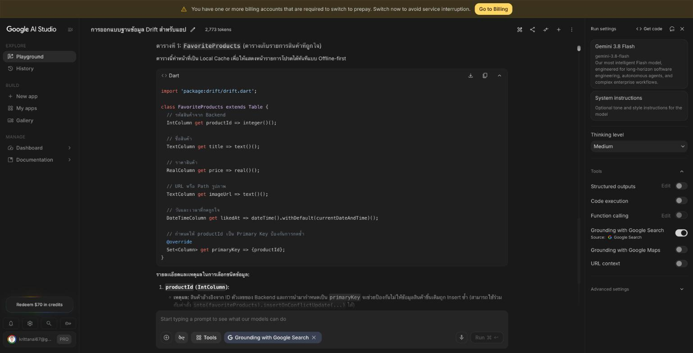

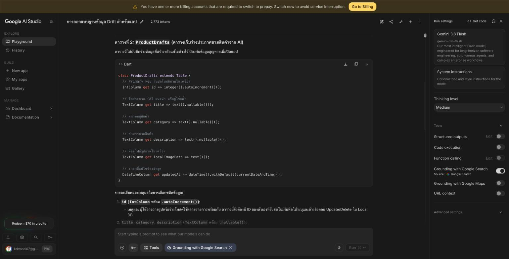

**1. Primary Key ถูกต้องหรือไม่**

ตารางร่างประกาศ (`ProductDrafts`) ถูกต้อง ใช้ `id` เป็น `integer().autoIncrement()` ตามบทเรียน แต่ตาราง Favorites ไม่ตรง Gemini ไม่มี `id` ของตัวเองเลย แต่เอา `productId` (id สินค้าจาก API) มาเป็น Primary Key แทนผ่าน `override primaryKey`

วิธีนี้ใช้งานได้ แต่ทำให้ Primary Key ของตารางเราผูกกับข้อมูลจากภายนอก ถ้าวันหนึ่งเปลี่ยนแหล่งข้อมูล (เช่น ย้ายไป Firebase ที่ id เป็น String) ต้องแก้ Primary Key ทั้งตาราง จึงแก้ตามบทเรียน คือมี `id` เป็น Auto-increment Integer ของตารางเอง แล้วเก็บ id สินค้าแยกไว้ใน `itemId`

**2. ชนิดข้อมูลของราคา**

Gemini เลือก `RealColumn` (`real()`) ซึ่งตรงกับที่บทเรียนแนะนำ ใน Dart จะได้ `double` ไม่ต้องแก้ ถ้าใช้ `IntColumn` ราคาอย่าง 9.99 จะเพี้ยนเป็น 9

**3. เก็บสำเนาข้อมูลหรือเก็บแค่ itemId**

Gemini เสนอให้เก็บสำเนา `title`, `price`, `imageUrl` ไว้ในตารางด้วย ซึ่งถูกต้องตามหลัก Offline-first ถ้าเก็บแค่ `itemId` แล้วไปเรียก API ทุกครั้งที่เปิดหน้ารายการโปรด พอไม่มีอินเทอร์เน็ตหน้านี้จะว่างหรือ Error ทั้งที่ผู้ใช้เคยกดถูกใจไว้แล้ว การเก็บสำเนาทำให้หน้ารายการโปรดอ่านจากฐานข้อมูลในเครื่องได้ทันทีโดยไม่ต้องพึ่งเครือข่าย (ข้อเสียคือราคาอาจไม่อัปเดตถ้าร้านเปลี่ยนราคา แต่สำหรับรายการโปรดถือว่ายอมรับได้) มีข้อสังเกตคือรูปยังเป็นแค่ URL ถ้าไม่มีเน็ตตัวรูปจะโหลดไม่ขึ้น แต่ชื่อกับราคายังแสดงได้

**4. `.unique()` ที่คอลัมน์อ้างอิงสินค้า**

Gemini ไม่ได้ใส่ `.unique()` เพราะใช้ `productId` เป็น Primary Key ซึ่งห้ามซ้ำอยู่แล้วโดยปริยาย แต่พอเปลี่ยนมาใช้ `id` แบบ Auto-increment ตามข้อ 1 คอลัมน์ `itemId` จะไม่มีข้อบังคับเรื่องซ้ำอีกต่อไป จึงต้องเพิ่ม `integer().unique()` เอง ไม่งั้นกดหัวใจสินค้าเดิมกี่ครั้งก็ได้แถวใหม่ทุกครั้ง และตอน Insert ใช้ `InsertMode.insertOrIgnore` ให้การกดซ้ำไม่ทำอะไรแทนที่จะ Error (Gemini แนะนำ `insertOnConflictUpdate` ซึ่งจะเขียนทับแถวเดิม ไม่จำเป็นในกรณีนี้)

**ข้อสังเกตเพิ่มเติม:** Gemini ให้ `title`/`category`/`description` ของร่างเป็น `nullable()` แต่ในแอปนี้ร่างจะถูกบันทึกหลังผู้ใช้กด "ยืนยันร่างประกาศ" แล้วเท่านั้น ค่าพวกนี้จึงควรมีเสมอ จึงใช้ตามบทเรียนคือไม่ nullable และให้ `title` เป็น `withLength(min: 1, max: 100)` กันชื่อประกาศว่างหรือยาวเกิน

Schema ที่ใช้จริง (`lib/database/tables.dart`)

```dart
class FavoriteItems extends Table {
  IntColumn get id => integer().autoIncrement()();
  IntColumn get itemId => integer().unique()(); // .unique() ป้องกันถูกใจสินค้าชิ้นเดียวกันซ้ำ
  TextColumn get title => text()();
  RealColumn get price => real()();
  TextColumn get imageUrl => text()();
  DateTimeColumn get addedAt => dateTime().withDefault(currentDateAndTime)();
}

// ตั้งชื่อ class ที่ generate เป็น ListingDraftRow ไม่ให้ชนกับ ListingDraft เดิมที่เก็บผลจาก AI
@DataClassName('ListingDraftRow')
class ListingDrafts extends Table {
  IntColumn get id => integer().autoIncrement()();
  TextColumn get title => text().withLength(min: 1, max: 100)();
  TextColumn get category => text()();
  TextColumn get description => text()();
  TextColumn get imagePath => text()();
  DateTimeColumn get updatedAt => dateTime().withDefault(currentDateAndTime)();
}
```

---

## ส่วนที่ 2: ติดตั้ง Drift และประกาศตาราง

### ขั้นตอนที่ 2.1: ติดตั้งแพ็กเกจ 🔧 ทำตามขั้นตอน

เพิ่ม dependency ในไฟล์ `pubspec.yaml` ของโปรเจกต์ `campus_marketplace_w7` **ต่อจาก** `http`, `provider` และ `image_picker` ที่มีอยู่แล้วจากสัปดาห์ที่ 6-7 (ไม่ต้องลบของเดิม)

```yaml
dependencies:
  drift: ^2.20.0
  sqlite3_flutter_libs: ^0.5.24
  path_provider: ^2.1.4
  path: ^1.9.0

dev_dependencies:
  drift_dev: ^2.20.0
  build_runner: ^2.4.13
```

รัน `flutter pub get` ในเทอร์มินัล

### ขั้นตอนที่ 2.2: สร้างไฟล์ประกาศตาราง 🔧 ทำตามขั้นตอน

สร้างไฟล์ `lib/database/tables.dart` ตามโครงสร้างในบทเรียนหัวข้อ 8.4 (ใช้ Schema ตามบทเรียน เพื่อให้ตรงกับใบงานการทดลองในส่วนถัดไป )

```dart
import 'package:drift/drift.dart';

class FavoriteItems extends Table {
  IntColumn get id => integer().autoIncrement()();
  IntColumn get itemId => integer().unique()(); // .unique() ป้องกันถูกใจสินค้าชิ้นเดียวกันซ้ำ
  TextColumn get title => text()();
  RealColumn get price => real()();
  TextColumn get imageUrl => text()();
  DateTimeColumn get addedAt => dateTime().withDefault(currentDateAndTime)();
}

@DataClassName('ListingDraftRow') // ตั้งชื่อ Class ที่ Generate เอง ดูคำอธิบายด้านล่าง
class ListingDrafts extends Table {
  IntColumn get id => integer().autoIncrement()();
  TextColumn get title => text().withLength(min: 1, max: 100)();
  TextColumn get category => text()();
  TextColumn get description => text()();
  TextColumn get imagePath => text()();
  DateTimeColumn get updatedAt => dateTime().withDefault(currentDateAndTime)();
}
```

⚠️ **จุดที่พลาดง่ายมากในสัปดาห์นี้โดยเฉพาะ**: ปกติ Drift จะตั้งชื่อ Class ที่ Generate จากตารางด้วยการตัด `s` ท้ายชื่อ Table ออก (เช่นตาราง `FavoriteItems` → Class `FavoriteItem` ตามที่เรียนในบทหนังสือเรียน) ถ้าปล่อยให้ `ListingDrafts` ทำแบบเดียวกัน Drift จะสร้าง Class ชื่อ `ListingDraft` ออกมา ซึ่ง**ชนกับ Class `ListingDraft` ที่สร้างไว้แล้วตั้งแต่ใบงานการทดลองที่ 7** (เก็บแค่ `title`/`category`/`description` ที่ได้จาก AI ก่อนบันทึก) ทำให้โปรเจกต์มี 2 Class ชื่อเดียวกันคนละความหมายและคอมไพล์ไม่ผ่านเพราะ import ชนกัน Annotation `@DataClassName('ListingDraftRow')` ด้านบนแก้ปัญหานี้โดยสั่งให้ Driftตั้งชื่อ Class ที่ Generate เป็น `ListingDraftRow` แทน 


---

## ส่วนที่ 3: สร้างคลาสฐานข้อมูลหลักและรัน Code Generation

### ขั้นตอนที่ 3.1: สร้าง AppDatabase 🔧 ทำตามขั้นตอน

ดูตัวอย่างโค้ดเต็มในบทเรียนหัวข้อ 8.4 ขั้นตอนที่ 3 แล้วคัดลอกมาสร้างไฟล์ `lib/database/app_database.dart` ของตนเอง (import ตารางจาก `tables.dart` ที่สร้างในส่วนที่ 2 เข้ามาใช้งาน พร้อม `@DriftDatabase(tables: [FavoriteItems, ListingDrafts])`) หากตั้งชื่อ Class ของตารางต่างจากตัวอย่าง ให้แก้ชื่อใน `@DriftDatabase(tables: [...])` ให้ตรงกับชื่อจริงใน `tables.dart` ของตนเองด้วย


### ขั้นตอนที่ 3.2: รัน Code Generation 🔧 ทำตามขั้นตอน

รันคำสั่งต่อไปนี้ในเทอร์มินัลของ VS Code ที่โฟลเดอร์โปรเจกต์

```bash
dart run build_runner build --delete-conflicting-outputs
```

รอจนกระบวนการเสร็จสิ้น ตรวจสอบว่ามีไฟล์ `lib/database/app_database.g.dart` ถูกสร้างขึ้นใหม่ และตรวจสอบใน Debug Console ว่าไม่มี Error เรื่อง Class ชื่อซ้ำ (ถ้าเจอ ให้กลับไปตรวจสอบ ขั้นตอน 2.2 ว่าใส่ `@DataClassName` ไว้ถูกต้องหรือไม่)

### ขั้นตอนที่ 3.3: เชื่อม AppDatabase เข้ากับแอป 🧠 คิดเอง (มีโครงให้)
**นักศึกษาเขียน Code เอง**

สัปดาห์นี้ซับซ้อนกว่าเดิมเล็กน้อย เพราะ `main.dart` ต้องสร้าง `AppDatabase` ขึ้นมาหนึ่งอินสแตนซ์ แล้วส่งต่อให้ Repository **สองตัว** (Favorites และ Draft) ที่จะสร้างในส่วนที่ 4-5 ก่อนส่งเข้า `MainScaffold` อีกที ตรวจสอบตามโครงนี้แล้วเติมส่วนที่ยังไม่มี (Repository ทั้งสองตัวจะสร้างจริงในส่วนถัดไป ตอนนี้แค่เตรียมจุดเชื่อมไว้ก่อน)

```
ในฟังก์ชัน main():
    สร้าง AppDatabase() ขึ้นมา 1 ตัว เก็บไว้ในตัวแปร db

    เรียก runApp() ห่อด้วย ChangeNotifierProvider<CartModel> เหมือนเดิม
    ส่ง db เข้าไปเป็นพารามิเตอร์ของ MyApp (เพิ่ม field ใหม่ใน MyApp รับค่า AppDatabase)

ใน MyApp.build(context):
    สร้าง MainScaffold โดยส่งพารามิเตอร์ 3 ตัวเข้าไป:
        itemRepository: ItemRepositoryApi() (ตัวเดิมจากสัปดาห์ที่ 6-7)
        favoritesRepository: สร้างจาก AppDatabase ที่รับมา (จะเขียน Class จริงในส่วนที่ 4)
        draftRepository: สร้างจาก AppDatabase ตัวเดียวกัน (จะเขียน Class จริงในส่วนที่ 5)
```

> 💡 สังเกตว่า `AppDatabase` ถูกสร้างขึ้น **ครั้งเดียว** ใน `main()` แล้วส่งต่อผ่าน Constructor ไปเรื่อย ๆ (Dependency Injection) หลักการเดียวกับที่ `ItemRepositoryApi()` ถูกสร้างครั้งเดียวแล้วส่งต่อมาตั้งแต่สัปดาห์ที่ 6 — ห้ามสร้าง `AppDatabase()` ใหม่หลายจุดในแอปเดียวกัน เพราะแต่ละอินสแตนซ์จะเปิดการเชื่อมต่อไฟล์ฐานข้อมูลแยกจากกัน ทำให้ข้อมูลที่เขียนจากจุดหนึ่งอาจไม่ปรากฏอีกจุดหนึ่ง

> ✅ **Checkpoint 3.1**

capture หน้าจอผลลัพธ์คำสั่ง `dart run build_runner build` จากขั้นตอนที่ 3.2 ที่แสดงว่าสร้างไฟล์สำเร็จ (ไม่มี Error เรื่อง Class ชื่อซ้ำ) จากนั้นเปิดไฟล์ main.dart ที่แก้ตามขั้นตอนที่ 3.3 โดย ยังไม่ต้องรันแอปในจุดนี้ เพราะ VS Code จะขีดเส้นสีแดงใต้ FavoritesRepositoryDrift และ ListingDraftRepositoryDrift (ยังไม่มี Class จริง จะเขียน Class นี้ในส่วนที่ 4-5) และถ้าสั่งรันตอนนี้แอปจะ Error ทันทีเพราะคอมไพล์ไม่ผ่าน ถือเป็นเรื่องปกติ — จะกลับมารันแอปได้จริงอีกครั้งหลังทำ Checkpoint 4.1 และ 5.1 เสร็จ

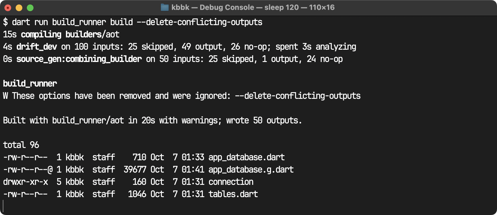

สร้าง `lib/database/app_database.g.dart` สำเร็จ (wrote 50 outputs) ไม่มี Error เรื่อง Class ชื่อซ้ำ เพราะใส่ `@DataClassName('ListingDraftRow')` ไว้แล้ว

`lib/database/app_database.dart`

```dart
import 'package:drift/drift.dart';
import 'connection/connection.dart';
import 'tables.dart';

part 'app_database.g.dart';

@DriftDatabase(tables: [FavoriteItems, ListingDrafts])
class AppDatabase extends _$AppDatabase {
  AppDatabase() : super(openConnection());

  // ใช้ในเทสต์ ส่งฐานข้อมูลในหน่วยความจำเข้ามาแทนไฟล์จริง
  AppDatabase.forTesting(super.executor);

  // ถ้าแก้โครงสร้างตารางหลังจากนี้ ต้องเพิ่มเลขนี้และเขียน migration รองรับ
  @override
  int get schemaVersion => 1;
}
```

`lib/main.dart` ที่แก้แล้ว สร้าง `AppDatabase` ครั้งเดียวแล้วส่งต่อให้ Repository ทั้งสองตัว

```dart
void main() {
  // สร้างฐานข้อมูลครั้งเดียวทั้งแอป แล้วส่งต่อให้ Repository ทุกตัวใช้ร่วมกัน
  final db = AppDatabase();

  runApp(
    ChangeNotifierProvider(
      create: (context) => CartModel(),
      child: MyApp(db: db),
    ),
  );
}

class MyApp extends StatelessWidget {
  final AppDatabase db;
  const MyApp({super.key, required this.db});

  @override
  Widget build(BuildContext context) {
    return MaterialApp(
      title: 'Campus Marketplace',
      debugShowCheckedModeBanner: false,
      home: MainScaffold(
        itemRepository: ItemRepositoryApi(),
        favoritesRepository: FavoritesRepositoryDrift(db),
        draftRepository: ListingDraftRepositoryDrift(db),
      ),
    );
  }
}
```

**ปัญหาที่เจอระหว่างติดตั้งและแก้ไข**

1. **`--delete-conflicting-outputs` ถูกเอาออกแล้ว** — `build_runner` ที่ได้มาคือเวอร์ชัน 2.15 รันคำสั่งตามใบงานแล้วขึ้นเตือน `These options have been removed and were ignored: --delete-conflicting-outputs` แต่ยัง generate ไฟล์ได้ปกติ (เวอร์ชันใหม่จัดการไฟล์ที่ชนกันให้เองแล้ว)
2. **`sqlite3_flutter_libs` ได้เวอร์ชัน `0.6.0+eol`** — ตอน `flutter pub add` ได้ `drift 2.35.1` ซึ่งใช้ `sqlite3` 3.x ที่รวมไลบรารี SQLite แบบ native มาให้แล้ว แพ็กเกจ `sqlite3_flutter_libs` จึงกลายเป็นแพ็กเกจเปล่า (README ของแพ็กเกจบอกว่าไม่ต้องใช้แล้วหลังอัปเกรด) ถ้าบังคับใช้ `^0.5.24` ตามใบงานจะชนกับ `sqlite3` 3.x จึงคงไว้ใน `pubspec.yaml` เป็น `^0.6.0+eol` ตามที่ใบงานให้เพิ่ม ไม่มีผลเสียอะไร
3. **แอปนี้รันบน Flutter Web** (เหมือนสัปดาห์ที่แล้ว) แต่โค้ดเปิดฐานข้อมูลแบบในบทเรียนใช้ `File` จาก `dart:io` + `NativeDatabase` ซึ่งไม่มีบน Web จึงแยกการเปิดการเชื่อมต่อเป็น 2 ไฟล์ แล้วให้ Dart เลือกตอนคอมไพล์

   ```dart
   // lib/database/connection/connection.dart
   export 'native.dart' if (dart.library.js_interop) 'web.dart';
   ```

   - `native.dart` ใช้โค้ดตามบทเรียน (`LazyDatabase` + `getApplicationDocumentsDirectory()` + `NativeDatabase.createInBackground`) สำหรับมือถือ/desktop
   - `web.dart` ใช้ `WasmDatabase.open(...)` รัน SQLite ที่คอมไพล์เป็น WebAssembly ต้องวางไฟล์ `sqlite3.wasm` และ `drift_worker.js` (ดาวน์โหลดจาก release ทางการของ drift เวอร์ชัน 2.35.1 ให้ตรงกับแพ็กเกจ) ไว้ในโฟลเดอร์ `web/` ข้อมูลเก็บใน storage ของเบราว์เซอร์ ปิดแท็บแล้วเปิดใหม่ยังอยู่
4. **Fake Store API ยังล่ม** (ตอบ `521` มาตั้งแต่สัปดาห์ที่แล้ว) หน้า Home จึงเปลี่ยน `ItemRepositoryApi` ไปใช้ DummyJSON เหมือนที่ทำในใบงานสัปดาห์ที่ 6 แก้แค่ Repository กับ `Item.fromJson` ไม่ต้องแตะ UI

---

## ส่วนที่ 4: สร้างฟีเจอร์ "รายการโปรด" (Favorites) ตั้งแต่ต้น

นี่คือฟีเจอร์ใหม่ทั้งหมดของแอป ประกอบด้วย 4 ส่วนที่ต้องทำให้ครบ คือ 1.Repository 2.ปุ่มกดถูกใจในหน้า Home 3.หน้าจอแสดงรายการโปรด และ 4.การเพิ่ม Tab ที่ 3 เข้า Bottom Navigation Bar

### ขั้นตอนที่ 4.1: สร้าง Repository Interface และ Implementation 
**นักศึกษาเขียน Code เอง**

สร้างไฟล์ `lib/repositories/favorites_repository.dart` (Interface) และ `lib/repositories/favorites_repository_drift.dart` (Implementation) เองทั้งหมด โดยอ้างอิงโครงสร้างและลำดับขั้นตอนจากบทเรียนหัวข้อ 8.4 (ซึ่งสอนตัวอย่างนี้ไว้แบบเต็มทุกบรรทัดอยู่แล้ว) สังเกตว่ารูปแบบนี้เหมือนกับ `ItemRepository`/`ItemRepositoryApi` ในสัปดาห์ที่ 6 ทุกประการ เพียงแค่เปลี่ยนจากการเรียก REST API มาเป็นการเรียก Drift แทน


**ข้อกำหนดที่ต้องมีครบ (ตรวจสอบตัวเองก่อนไปต่อ):**

- Interface `FavoritesRepository` ต้องมีอย่างน้อย 3 เมธอด: `addFavorite(int itemId, String title, double price, String imageUrl)`, `getAllFavorites()` (คืนค่า `Future<List<FavoriteItem>>` เรียงจากกดถูกใจล่าสุด), `removeFavorite(int itemId)`
- Class `FavoritesRepositoryDrift implements FavoritesRepository` ต้องรับ `AppDatabase` เข้ามาทาง Constructor (เหมือน `final AppDatabase _db;`)
- ทุกเมธอดต้องเขียนลง/อ่านจาก `_db.favoriteItems` เท่านั้น ห้ามมีโค้ดเรียก `http`/Dio ปะปนอยู่เลย (ตามหลักการ Offline-first หัวข้อ 8.6)
- `getAllFavorites()` ต้องเรียงผลลัพธ์ด้วย `orderBy` ตามคอลัมน์ `addedAt` จากใหม่ไปเก่า
- `addFavorite(...)` ต้องเรียก `.insert(...)` พร้อมระบุ `mode: InsertMode.insertOrIgnore` เพราะคอลัมน์ `itemId` เป็น `.unique()` (Checkpoint 2.1) ถ้าไม่ใส่ การกดหัวใจซ้ำที่สินค้าชิ้นเดิมจะทำให้แอป Error ด้วย `UNIQUE constraint failed` แทนที่จะแค่ไม่มีอะไรเกิดขึ้น

### ขั้นตอนที่ 4.2: เพิ่มปุ่ม "กดถูกใจ" ในหน้า Home 🧠 คิดเอง (มีโครงให้)

แก้ไข `lib/screens/home_page.dart` ให้รับ `FavoritesRepository` เข้ามาทาง Constructor เพิ่มอีก 1 ตัว (คู่กับ `ItemRepository` ที่มีอยู่แล้ว) แล้วเพิ่มไอคอนรูปหัวใจต่อท้ายแต่ละแถวสินค้าใน `ListTile` คู่กับไอคอนตะกร้าที่มีอยู่แล้ว

**แนวทางเขียนโค้ด (Pseudocode)** — ลองไล่ตามลำดับนี้แล้วแปลงเป็น Dart ด้วยตัวเอง

```
ใน HomePage (StatefulWidget):
    เพิ่ม field favoritesRepository ชนิด FavoritesRepository ใน Constructor

ใน trailing ของแต่ละ ListTile (ปัจจุบันมีแค่ปุ่มตะกร้า):
    เปลี่ยนจาก IconButton เดี่ยว เป็น Row ที่มี mainAxisSize: MainAxisSize.min แล้วใส่ 2 ปุ่ม:
        ปุ่มที่ 1: ไอคอนรูปหัวใจ (Icons.favorite_border)
            เมื่อกด → เรียก widget.favoritesRepository.addFavorite(item.id, item.title, item.price, item.imageUrl)
            เนื่องจากเป็น Future ต้องจัดการ error ด้วย try/catch หรือ .catchError() แล้วแสดง SnackBar แจ้งผล (สำเร็จ/ผิดพลาด)
        ปุ่มที่ 2: ปุ่มตะกร้าเดิม (ไม่ต้องแก้ไข)
```

**คำใบ้ / จุดที่ต้องระวัง**

- `addFavorite(...)` เป็น `Future<void>` ดังนั้นฟังก์ชันที่เรียกมันใน `onPressed` ควรเป็น `async` เพื่อ `await` และจับ error ได้ถูกต้อง
- ไม่ต้องเปลี่ยนไอคอนหัวใจให้ทึบ (Toggle สถานะ) ในสัปดาห์นี้ — แค่กดแล้วเพิ่มลงฐานข้อมูลสำเร็จพร้อม SnackBar ยืนยันก็เพียงพอ (การเอาออกจากรายการโปรดทำที่หน้า Favorites โดยเฉพาะในขั้นตอนถัดไป เหมือนกับที่การลบออกจากตะกร้าทำที่หน้า Checkout ไม่ใช่หน้า Home)
- อย่าลืมแก้จุดที่สร้าง `HomePage(...)` ใน `MainScaffold` (ขั้นตอนที่ 4.4) ให้ส่ง `favoritesRepository` เข้าไปด้วย ไม่งั้นจะ Error ว่าพารามิเตอร์ที่จำเป็นหายไป

### ขั้นตอนที่ 4.3: สร้างหน้าจอ "รายการโปรด" (FavoritesPage) 
**นักศึกษาเขียน Code เอง**
สร้างไฟล์ `lib/screens/favorites_page.dart` เป็น `StatefulWidget` ที่รับ `FavoritesRepository` เข้ามาทาง Constructor

**ข้อกำหนดที่ต้องมีครบ:**

- ใช้ `FutureBuilder` เรียก `repository.getAllFavorites()` ใน `initState()` (รูปแบบเดียวกับ `HomePage` ที่เรียก `repository.getItems()` มาตั้งแต่สัปดาห์ที่ 6)
- จัดการ 3 สถานะให้ครบ: กำลังโหลด (`CircularProgressIndicator`), รายการว่างเปล่า (ข้อความแนะนำ เช่น "ยังไม่มีรายการโปรด ลองกดหัวใจที่หน้าหลักดูสิ"), และมีข้อมูล (`ListView.builder` แสดง title/price/imageUrl)
- แต่ละแถวมีปุ่มลบ (`IconButton` ไอคอนถังขยะ) ที่เรียก `repository.removeFavorite(itemId)` แล้ว `setState()` เพื่อโหลดรายการใหม่ (เรียก `getAllFavorites()` ซ้ำแล้วอัปเดต Future ที่ผูกกับ `FutureBuilder`)
- ไม่ต้องรับ `ItemRepository` เข้ามาในหน้านี้ เพราะข้อมูลที่แสดง (title/price/imageUrl) ถูกเก็บสำเนาไว้ในตาราง `FavoriteItems` ครบอยู่แล้วตามที่ออกแบบไว้ในส่วนที่ 1 — ไม่ต้องเรียก Fake Store API ซ้ำ

### ขั้นตอนที่ 4.4: เพิ่ม Tab ที่ 3 เข้า MainScaffold ที่มีอยู่แล้ว 🔧 ทำตามขั้นตอน

ตามที่ `campus_marketplace_lab_roadmap.md` หัวข้อ 2.1 วางแผนไว้ Favorites คือ Tab ที่ 3 ของแอป เปิดไฟล์ `lib/screens/main_scaffold.dart` ที่สร้างไว้แล้วตั้งแต่สัปดาห์ที่ 7 แล้วแก้ไขตามนี้ **ไม่ต้องแก้ไขโค้ดภายใน `HomePage` หรือ `SellItemPage` เพิ่มเติมจากที่ทำในขั้นตอนก่อนหน้านี้**

```dart
// ก่อนแก้
class MainScaffold extends StatefulWidget {
  final ItemRepository repository;
  const MainScaffold({super.key, required this.repository});
  // ...
}
```

```dart
// หลังแก้
class MainScaffold extends StatefulWidget {
  final ItemRepository itemRepository;
  final FavoritesRepository favoritesRepository;
  final ListingDraftRepository draftRepository; // จะมีจริงหลังทำส่วนที่ 5 เสร็จ
  const MainScaffold({
    super.key,
    required this.itemRepository,
    required this.favoritesRepository,
    required this.draftRepository,
  });
  // ...
}
```

และในเมธอด `build`

```dart
// ก่อนแก้
final pages = [
  HomePage(repository: widget.repository),
  const SellItemPage(),
];
// ...
items: const [
  BottomNavigationBarItem(icon: Icon(Icons.storefront), label: 'หน้าหลัก'),
  BottomNavigationBarItem(icon: Icon(Icons.add_a_photo), label: 'ลงประกาศขาย'),
],
```

```dart
// หลังแก้
final pages = [
  HomePage(
    repository: widget.itemRepository,
    favoritesRepository: widget.favoritesRepository,
  ),
  SellItemPage(draftRepository: widget.draftRepository),
  FavoritesPage(repository: widget.favoritesRepository),
];
// ...
items: const [
  BottomNavigationBarItem(icon: Icon(Icons.storefront), label: 'หน้าหลัก'),
  BottomNavigationBarItem(icon: Icon(Icons.add_a_photo), label: 'ลงประกาศขาย'),
  BottomNavigationBarItem(icon: Icon(Icons.favorite), label: 'รายการโปรด'),
],
```

อย่าลืมเพิ่ม `import 'favorites_page.dart';`, `import '../repositories/favorites_repository.dart';` และ `import '../repositories/listing_draft_repository.dart';` ที่หัวไฟล์ และแก้ `lib/main.dart` ให้ส่งพารามิเตอร์ตามชื่อใหม่ (`itemRepository:`, `favoritesRepository:`, `draftRepository:`) ตามโครงที่วางไว้ในขั้นตอนที่ 3.3

> ⚠️ `IndexedStack` อ้างอิง index ตามตำแหน่งใน List `pages` และ `BottomNavigationBarItem` ต้องมีจำนวนเท่ากับ `pages` เสมอ (ตอนนี้ต้องเป็น 3 ทั้งคู่) ถ้าจำนวนไม่ตรงกันแอปจะ Error ทันทีตอนรัน ไม่ใช่แค่แสดงผลผิด

> ✅ **Checkpoint 4.1** รันแอปแล้วทดสอบ: (ก) กดหัวใจที่สินค้า 3 ชิ้นจากหน้า Home (ข) สลับไป Tab "รายการโปรด" เห็นครบทั้ง 3 ชิ้น (ค) ปิดแอปให้สนิท (Force Stop หรือปัดออกจาก Recent Apps) แล้วเปิดใหม่ กลับไปที่ Tab รายการโปรดอีกครั้ง ถ่ายภาพหน้าจอ (ข) และ (ค) เทียบกัน ต้องแสดงรายการเดิมครบทุกชิ้น พร้อมทดสอบกดลบ (Remove) 1 ชิ้น แล้วปิดเปิดแอปใหม่อีกครั้งเพื่อยืนยันว่าการลบก็ถูกบันทึกถาวรเช่นกัน (ง) กลับไปหน้า Home แล้วกดหัวใจซ้ำที่สินค้าชิ้นเดิมอีกครั้ง (ชิ้นที่ยังไม่ได้ลบ) แล้วตรวจสอบที่ Tab รายการโปรดว่ายังแสดงสินค้าชิ้นนั้นแค่แถวเดียว ไม่ซ้ำเป็น 2 แถว และแอปไม่ Error

ทดสอบบน Flutter Web (Chrome) การ "ปิดแอปให้สนิท" คือปิดแท็บทิ้งแล้วเปิดแท็บใหม่ ซึ่งต้องโหลดแอปและเปิดฐานข้อมูลใหม่ทั้งหมด เทียบเท่ากับ Force Stop บนมือถือ

**(ก)–(ข)** กดหัวใจที่ Essence Mascara, Powder Canister และ Chanel Coco Noir จากหน้า Home แล้วสลับมา Tab "รายการโปรด" เห็นครบ 3 ชิ้น เรียงจากกดล่าสุดก่อน


**(ค)** ปิดแท็บแล้วเปิดใหม่ กลับมาที่ Tab รายการโปรด รายการเดิมยังอยู่ครบทั้ง 3 ชิ้นในลำดับเดิม


กดลบ Powder Canister (ขึ้น SnackBar ยืนยัน)

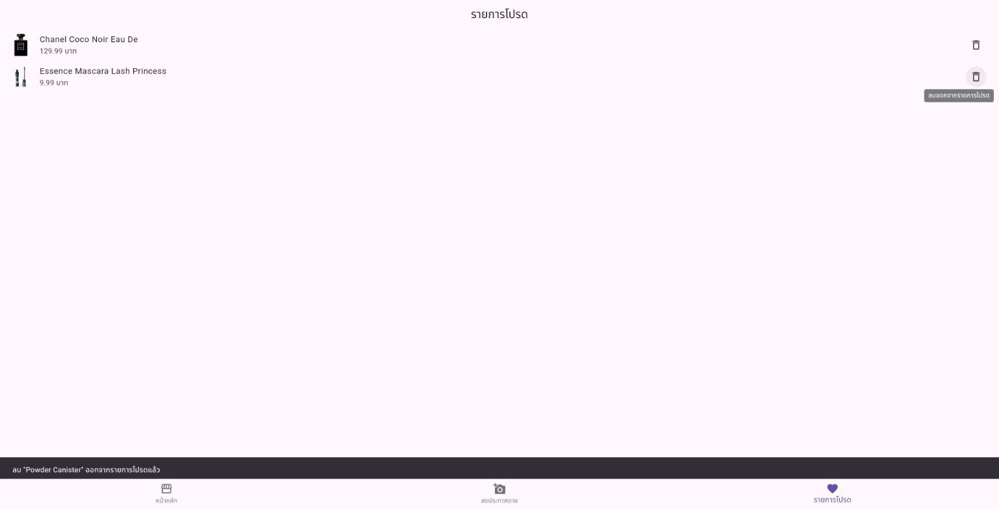

ปิดแท็บแล้วเปิดใหม่อีกครั้ง เหลือ 2 ชิ้น การลบถูกบันทึกถาวรเช่นกัน


**(ง)** กลับไปหน้า Home กดหัวใจที่ Essence Mascara (ชิ้นที่ยังอยู่ในรายการโปรด) ซ้ำอีกครั้ง แอปไม่ Error และขึ้น SnackBar ตามปกติ

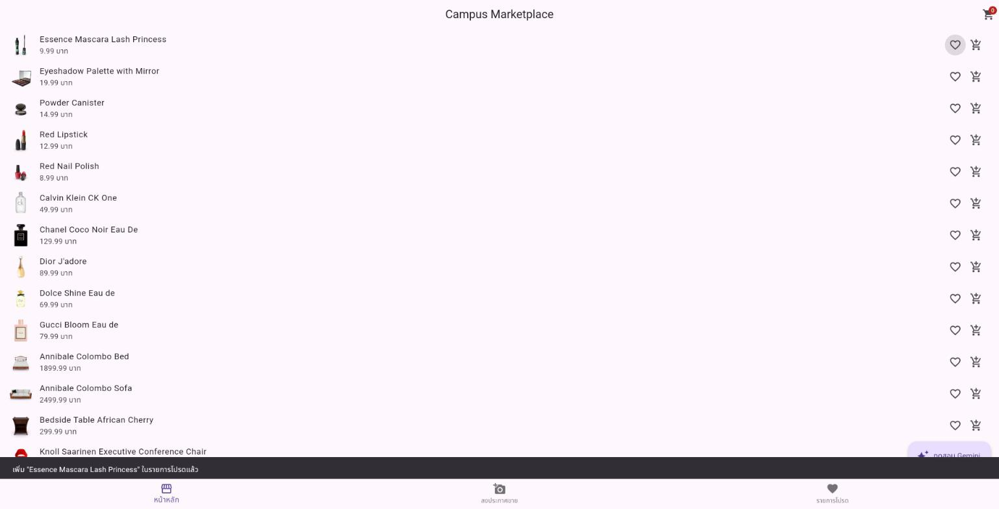

ที่ Tab รายการโปรด Essence Mascara ยังมีแค่แถวเดียว ไม่ซ้ำเป็น 2 แถว เพราะ `itemId` เป็น `.unique()` และ `addFavorite` ใช้ `InsertMode.insertOrIgnore`

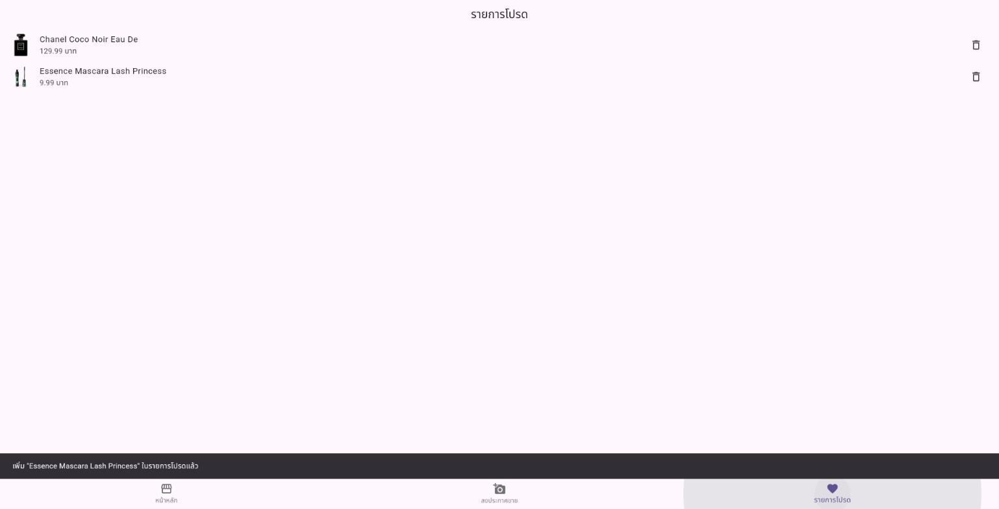

**โค้ดหลักที่เขียน**

`lib/repositories/favorites_repository.dart`

```dart
abstract class FavoritesRepository {
  Future<void> addFavorite(int itemId, String title, double price, String imageUrl);

  /// เรียงจากสินค้าที่กดถูกใจล่าสุดก่อน
  Future<List<FavoriteItem>> getAllFavorites();

  Future<void> removeFavorite(int itemId);
}
```

`lib/repositories/favorites_repository_drift.dart`

```dart
class FavoritesRepositoryDrift implements FavoritesRepository {
  final AppDatabase _db;

  FavoritesRepositoryDrift(this._db);

  @override
  Future<void> addFavorite(int itemId, String title, double price, String imageUrl) async {
    await _db.into(_db.favoriteItems).insert(
          FavoriteItemsCompanion.insert(
            itemId: itemId,
            title: title,
            price: price,
            imageUrl: imageUrl,
          ),
          // itemId เป็น unique ถ้ากดหัวใจสินค้าเดิมซ้ำให้ข้ามไปเฉย ๆ แทนที่จะ error
          mode: InsertMode.insertOrIgnore,
        );
  }

  @override
  Future<List<FavoriteItem>> getAllFavorites() {
    return (_db.select(_db.favoriteItems)
          ..orderBy([(t) => OrderingTerm.desc(t.addedAt)]))
        .get();
  }

  @override
  Future<void> removeFavorite(int itemId) async {
    await (_db.delete(_db.favoriteItems)..where((t) => t.itemId.equals(itemId))).go();
  }
}
```

ปุ่มหัวใจใน `home_page.dart`

```dart
  Future<void> _addFavorite(Item item) async {
    String message;
    try {
      await widget.favoritesRepository.addFavorite(item.id, item.title, item.price, item.imageUrl);
      message = 'เพิ่ม "${item.title}" ในรายการโปรดแล้ว';
    } catch (e) {
      message = 'บันทึกรายการโปรดไม่สำเร็จ กรุณาลองใหม่';
    }
    // รอให้ Flutter Web render frame ก่อนแสดง SnackBar เหมือนปุ่มตะกร้า
    await Future.delayed(const Duration(milliseconds: 100));
    if (!mounted) return;
    ScaffoldMessenger.of(context).clearSnackBars();
    ScaffoldMessenger.of(context).showSnackBar(SnackBar(content: Text(message)));
  }
  ...
                trailing: Row(
                  mainAxisSize: MainAxisSize.min,
                  children: [
                    IconButton(
                      icon: const Icon(Icons.favorite_border),
                      tooltip: 'เพิ่มในรายการโปรด',
                      onPressed: () => _addFavorite(item),
                    ),
                    IconButton(
                      icon: const Icon(Icons.add_shopping_cart),
                      onPressed: () async { /* ปุ่มตะกร้าเดิม */ },
                    ),
                  ],
                ),
```

**จุดที่ต้องระวังเพิ่ม:** `MainScaffold` ใช้ `IndexedStack` ซึ่งสร้างทุก Tab ไว้ตั้งแต่เปิดแอป `initState()` ของ `FavoritesPage` จึงถูกเรียกแค่ครั้งเดียวตอนนั้น ถ้าไม่ทำอะไรเพิ่ม กดหัวใจที่หน้า Home แล้วสลับมา Tab รายการโปรดจะยังเห็นรายการเก่าจนกว่าจะปิดเปิดแอปใหม่ จึงเพิ่มเมธอด `reload()` ใน `FavoritesPage` แล้วให้ `MainScaffold` เรียกผ่าน `GlobalKey` ทุกครั้งที่ผู้ใช้กดเข้า Tab รายการโปรด

```dart
  final _favoritesKey = GlobalKey<FavoritesPageState>();
  ...
        onTap: (index) {
          setState(() => _selectedIndex = index);
          if (index == 2) _favoritesKey.currentState?.reload();
        },
```

นอกจากนี้เขียนเทสต์ `test/repositories_test.dart` ทดสอบ Repository กับฐานข้อมูล SQLite ในหน่วยความจำ (`NativeDatabase.memory()`) ว่ากดถูกใจซ้ำแล้วยังมีแถวเดียว เรียงจากใหม่ไปเก่า และลบได้ ผ่านทั้งหมด

---

## ส่วนที่ 5: นำร่างประกาศขายสินค้า (สัปดาห์ที่ 7) มาบันทึกถาวร

### ขั้นตอนที่ 5.1: สร้าง Repository สำหรับ Draft 
**นักศึกษาเขียน Code เอง**

สร้างไฟล์ `lib/repositories/listing_draft_repository.dart` (Interface) และ `lib/repositories/listing_draft_repository_drift.dart` (Implementation) ในรูปแบบเดียวกับส่วนที่ 4 ทุกประการ แต่ทำงานกับตาราง `ListingDrafts` แทน

**ข้อกำหนดที่ต้องมีครบ:**

- Interface `ListingDraftRepository` ต้องมีอย่างน้อย 3 เมธอด: `saveDraft(ListingDraft draft, String imagePath)` (บันทึกร่างใหม่ — รับ `ListingDraft` ที่มีอยู่แล้วจากสัปดาห์ 7 บวก path รูปภาพแยกต่างหาก เพราะ `ListingDraft` เดิมไม่มี field นี้), `getAllDrafts()` (คืนค่า `Future<List<ListingDraftRow>>` เรียงจากแก้ไขล่าสุด — สังเกตว่าใช้ `ListingDraftRow` ไม่ใช่ `ListingDraft` ตามที่อธิบายไว้ใน Checkpoint 2.1), และ `deleteDraft(int id)`
- `saveDraft(...)` ต้องดึงค่า `draft.title`, `draft.category`, `draft.description` มาประกอบกับ `imagePath` ที่รับมาแยก แล้วสร้าง `ListingDraftsCompanion.insert(...)` ก่อน `.insert()` ลงฐานข้อมูล

### ขั้นตอนที่ 5.2: แก้ไขหน้า "ลงประกาศขายสินค้า" ให้บันทึกร่างถาวร 🔧 ทำตามขั้นตอน 

เปิดไฟล์ `sell_item_page.dart` จากสัปดาห์ที่ 7 แก้ไข 2 จุด: (1) รับ `ListingDraftRepository` เข้ามาทาง Constructor และ (2) แก้ปุ่ม "ยืนยันร่างประกาศ" (ที่เดิมแค่เก็บค่าไว้ใน State ชั่วคราวตามใบงานสัปดาห์ที่ 7 ส่วนที่ 5.2)

```dart
// ก่อนแก้
class SellItemPage extends StatefulWidget {
  const SellItemPage({super.key});
  // ...
}
```

```dart
// หลังแก้
class SellItemPage extends StatefulWidget {
  final ListingDraftRepository draftRepository;
  const SellItemPage({super.key, required this.draftRepository});
  // ...
}
```

และในปุ่ม "ยืนยันร่างประกาศ" เปลี่ยนจากการเก็บค่าไว้ในตัวแปร State เฉย ๆ ให้เรียก `await widget.draftRepository.saveDraft(draft, imageFile!.path)` แทน จัดการ Loading/Success/Error ระหว่างบันทึกเช่นเดียวกับที่เคยทำตอนเรียก Gemini Vision ในสัปดาห์ที่ 7 แล้วค่อยแสดง `SnackBar` ยืนยันและล้างฟอร์มเหมือนเดิมหลังบันทึกสำเร็จ

### ขั้นตอนที่ 5.3: สร้างหน้าจอ "ร่างประกาศของฉัน" (My Drafts) 
**นักศึกษาเขียน Code เอง**

สร้างหน้าจอใหม่ `lib/screens/my_drafts_page.dart` ที่รับ `ListingDraftRepository` เข้ามาทางConstructor เรียก `repository.getAllDrafts()` แสดงรายการร่างทั้งหมดที่เคยบันทึกไว้เป็น `ListView` (รูปแบบเดียวกับ `FavoritesPage` ในส่วนที่ 4.3) แต่ละรายการแสดงชื่อประกาศ หมวดหมู่ และวันเวลาที่แก้ไขล่าสุด พร้อมปุ่มลบร่างที่ไม่ต้องการแล้ว จัดการสถานะ Loading/Success/Empty ให้ครบ

**ทำไมหน้านี้ไม่ใช่ Tab ที่ 4**: ตาม `campus_marketplace_lab_roadmap.md` หัวข้อ 2.1 มีกฎชัดเจนว่าอะไรควรเป็น Tab (ปลายทางหลักที่สลับไปมาตลอดเวลา) กับอะไรควรเป็น Push/Pop (Flow เฉพาะกิจที่มีจุดเริ่ม-จบ) "ร่างประกาศของฉัน" เป็นหน้าจัดการร่างที่ผูกกับ Flow การลงประกาศโดยตรง ไม่ใช่ปลายทางหลักที่ผู้ใช้เปิดดูตลอดเวลาเหมือน Favorites อีกทั้ง Roadmap ได้กำหนดไว้แล้วว่า Tab ที่ 4 ของแอปคือ "โปรไฟล์" ในสัปดาห์หน้า การเพิ่ม Tab ใหม่อีกตัวตอนนี้จะทำให้ลำดับ Tab ทั้งเทอมเพี้ยนไปจากแผน **จึงให้เข้าถึงหน้านี้ด้วยปุ่มไอคอนใน AppBar ของ Tab "ลงประกาศขาย" แทน** (เช่น `IconButton(icon: Icon(Icons.history), onPressed: () => Navigator.push(...))`) เพิ่ม `AppBar` ให้ `SellItemPage` ถ้ายังไม่มี แล้วใส่ปุ่มนี้ไว้ที่ `actions`

> ✅ **Checkpoint 5.1** รันแอปแล้วทำตามลำดับนี้: 1. สร้างร่างประกาศใหม่ผ่าน Tab "ลงประกาศขาย" ด้วยความช่วยเหลือของ AI เหมือนสัปดาห์ที่ 7 2. กดยืนยันร่าง 3. กดปุ่มไอคอนเข้าหน้า "ร่างประกาศของฉัน" แล้วเห็นร่างที่เพิ่งสร้าง 4. ปิดแอปให้สนิทแล้วเปิดใหม่ กลับเข้าหน้า "ร่างประกาศของฉัน" อีกครั้ง ถ่ายภาพหน้าจอทั้ง 4 ขั้นตอนนี้แนบส่ง เพื่อพิสูจน์ว่าร่างไม่หายไปแม้ปิดแอปแล้ว 

ใช้รูปหูฟังเป็นสินค้าทดสอบ

**1. สร้างร่างประกาศด้วย AI** เลือกรูปแล้วกด "ให้ AI ช่วยแนะนำ" Gemini ร่างชื่อประกาศ หมวดหมู่ และคำบรรยายมาให้ตรวจทาน

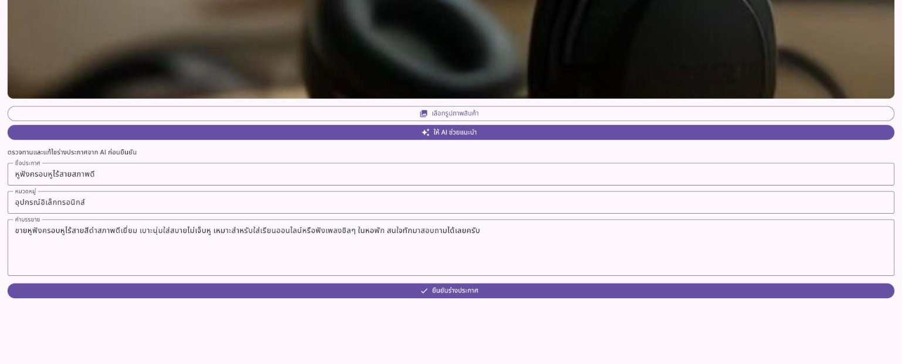

**2. กดยืนยันร่าง** บันทึกลงฐานข้อมูลสำเร็จ ขึ้น SnackBar "บันทึกร่างประกาศเรียบร้อยแล้ว" และฟอร์มถูกล้างพร้อมลงประกาศใหม่

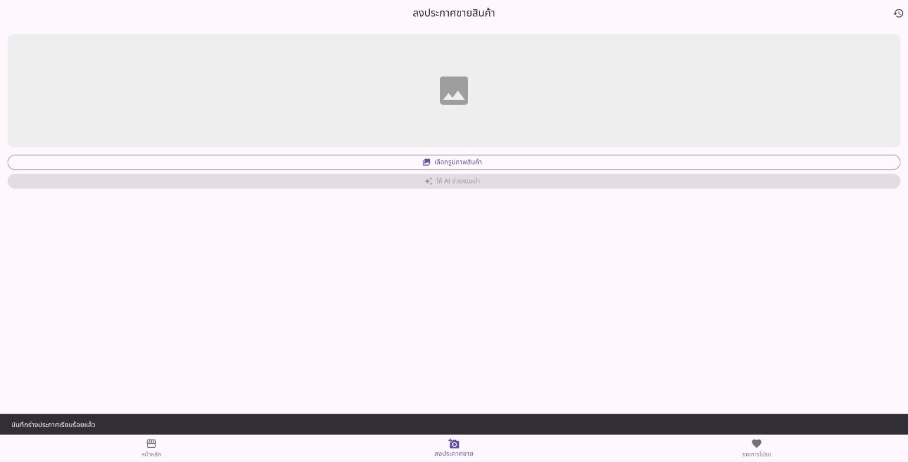

**3. กดไอคอนประวัติที่ AppBar เข้าหน้า "ร่างประกาศของฉัน"** เห็นร่างที่เพิ่งสร้าง พร้อมหมวดหมู่และเวลาที่แก้ไขล่าสุด


**4. ปิดแท็บแล้วเปิดแอปใหม่** กลับเข้าหน้า "ร่างประกาศของฉัน" ร่างยังอยู่ครบ ไม่หายแม้ปิดแอป


**โค้ดหลักที่เขียน**

`lib/repositories/listing_draft_repository.dart`

```dart
abstract class ListingDraftRepository {
  /// ListingDraft เดิมไม่มี path รูป จึงรับ imagePath แยกเข้ามา
  Future<void> saveDraft(ListingDraft draft, String imagePath);

  /// เรียงจากร่างที่แก้ไขล่าสุดก่อน
  Future<List<ListingDraftRow>> getAllDrafts();

  Future<void> deleteDraft(int id);
}
```

`lib/repositories/listing_draft_repository_drift.dart`

```dart
class ListingDraftRepositoryDrift implements ListingDraftRepository {
  final AppDatabase _db;

  ListingDraftRepositoryDrift(this._db);

  @override
  Future<void> saveDraft(ListingDraft draft, String imagePath) async {
    await _db.into(_db.listingDrafts).insert(
          ListingDraftsCompanion.insert(
            title: draft.title,
            category: draft.category,
            description: draft.description,
            imagePath: imagePath,
          ),
        );
  }

  @override
  Future<List<ListingDraftRow>> getAllDrafts() {
    return (_db.select(_db.listingDrafts)
          ..orderBy([(t) => OrderingTerm.desc(t.updatedAt)]))
        .get();
  }

  @override
  Future<void> deleteDraft(int id) async {
    await (_db.delete(_db.listingDrafts)..where((t) => t.id.equals(id))).go();
  }
}
```

ปุ่ม "ยืนยันร่างประกาศ" ใน `sell_item_page.dart` เปลี่ยนจากเก็บใน List ของ State มาบันทึกผ่าน Repository พร้อมสถานะกำลังบันทึก/สำเร็จ/ผิดพลาด

```dart
  Future<void> _confirmDraft() async {
    final finalDraft = ListingDraft(
      title: _titleController.text.trim(),
      category: _categoryController.text.trim(),
      description: _descriptionController.text.trim(),
    );

    setState(() => _isSaving = true);
    String message;
    try {
      // บันทึกลง SQLite แทนการเก็บใน List ของ State ปิดแอปแล้วร่างยังอยู่
      await widget.draftRepository.saveDraft(finalDraft, _selectedImage!.path);
      message = 'บันทึกร่างประกาศเรียบร้อยแล้ว';
      setState(() {
        _selectedImage = null;
        _imageBytes = null;
        _draft = null;
        _errorMessage = null;
        _titleController.clear();
        _categoryController.clear();
        _descriptionController.clear();
      });
    } catch (e) {
      // เช่น ชื่อประกาศว่างหรือยาวเกิน 100 ตัวอักษร ซึ่งขัดกับ withLength ของตาราง
      message = 'บันทึกร่างไม่สำเร็จ ตรวจสอบว่าชื่อประกาศไม่ว่างและยาวไม่เกิน 100 ตัวอักษร';
    } finally {
      setState(() => _isSaving = false);
    }

    // รอ 100ms ให้ Flutter Web render frame ให้พร้อมก่อนแสดง SnackBar
    await Future.delayed(const Duration(milliseconds: 100));
    if (!mounted) return;
    ScaffoldMessenger.of(context).clearSnackBars();
    ScaffoldMessenger.of(context).showSnackBar(SnackBar(content: Text(message)));
  }
```

**ปัญหาที่เจอ**

1. **Gemini ตอบ 402** — ครั้งแรกที่ทดสอบใช้ API Key เดิม Gemini ตอบกลับ `402 RESOURCE_EXHAUSTED: Your prepayment credits are depleted` เพราะเครดิตแบบ prepay ของโปรเจกต์นั้นหมด แอปแสดงข้อความ error ตามที่ออกแบบไว้ตั้งแต่สัปดาห์ที่ 7 (ไม่ค้าง ไม่ crash) แก้โดยสร้าง API Key ใหม่ในอีกโปรเจกต์แล้ว build ใหม่ด้วย `--dart-define=GEMINI_API_KEY=...`

   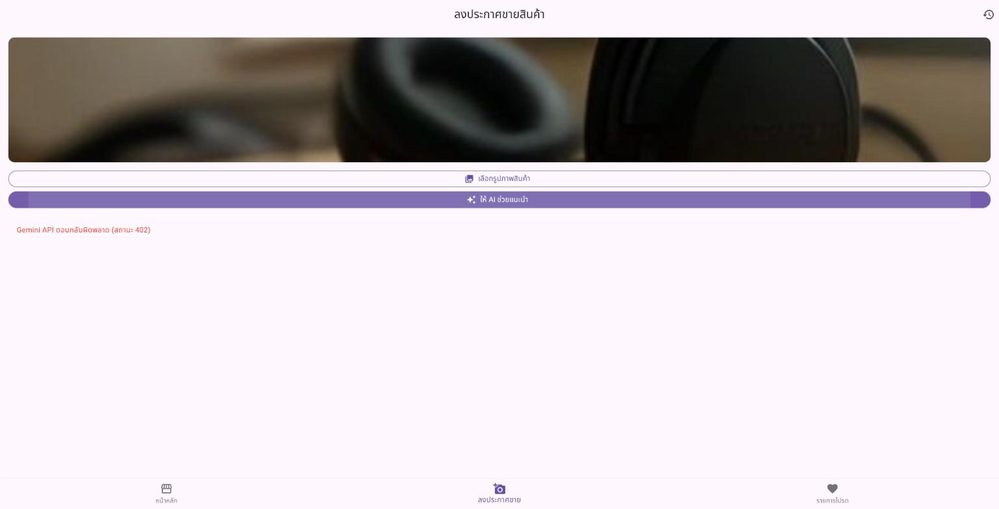

2. **path รูปบน Web** — บนมือถือ `XFile.path` คือ path ของไฟล์จริงในเครื่อง แต่บน Flutter Web เป็น `blob:` URL ชั่วคราวที่ใช้ได้แค่ในแท็บนั้น ร่างจึงบันทึกได้ครบแต่ถ้าจะแสดงรูปจาก `imagePath` ภายหลังบน Web จะเปิดไม่ได้ หน้า "ร่างประกาศของฉัน" ตามโจทย์แสดงแค่ชื่อ หมวดหมู่ และเวลาแก้ไข จึงไม่กระทบ ถ้าต้องการแสดงรูปบน Web ด้วยต้องเก็บตัวรูป (bytes) แยกไว้

---

## ส่วนที่ 6: ทดสอบสถานการณ์ Offline-first

### ขั้นตอนที่ 6.1: ปิดอินเทอร์เน็ตแล้วทดสอบ 🔧 ทำตามขั้นตอน

ปิด Wi-Fi และ Data บนอุปกรณ์ทดสอบ แล้วเปิดแอป `campus_marketplace_w7` เข้าไปที่ Tab "รายการโปรด" และหน้า "ร่างประกาศของฉัน"

> ✅ **Checkpoint 6.1** ถ่ายภาพหน้าจอที่แสดงให้เห็นว่า Tab รายการโปรดและหน้าร่างประกาศยังคงแสดงข้อมูลได้ตามปกติแม้ไม่มีอินเทอร์เน็ตเลย (ส่วน Tab หน้าหลักที่ดึงจาก Fake Store API คาดว่าจะแสดง Error ตามปกติ เพราะยังไม่ได้ทำ Local Cache ให้หน้านั้น) 

ทดสอบโดย**จำลอง**การไม่มีอินเทอร์เน็ต ไม่ได้ปิด Wi-Fi ของเครื่องจริง เพราะทดสอบผ่าน Flutter Web บนเครื่องที่ใช้ทำงาน วิธีคือเปิดแอปผ่านหน้า `offline.html` (สำเนาของ `index.html` ใน `build/web` สำหรับทดสอบเท่านั้น ไม่ได้อยู่ในโค้ดของโปรเจกต์) ที่ใส่สคริปต์ให้ทุก request ที่ออกไปนอกเครื่องล้มเหลวทันทีแบบเดียวกับตอนไม่มีเน็ต (`TypeError: Failed to fetch`) ตั้งแต่ก่อนแอปเริ่มทำงาน ยกเว้นไฟล์ของแอปเองและฟอนต์ ซึ่งบนมือถือจริงก็อยู่ในเครื่องอยู่แล้ว

**Tab หน้าหลัก** แสดง Error ตามที่คาดไว้ เพราะต้องดึงสินค้าจาก API และยังไม่มี Local Cache

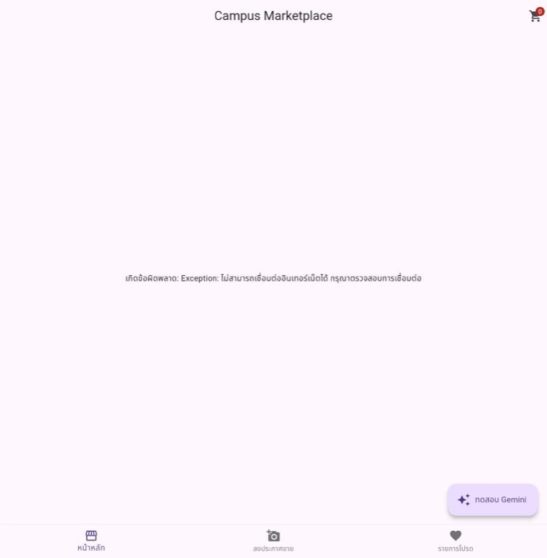

**Tab รายการโปรด** ยังแสดงชื่อและราคาสินค้าครบ เพราะอ่านจากตาราง `FavoriteItems` ในเครื่อง ส่วนรูปขึ้นเป็นไอคอนแทน เพราะตารางเก็บแค่ URL ของรูป ตัวรูปยังต้องโหลดผ่านเน็ต (ตรงกับข้อสังเกตที่เขียนไว้ในส่วนที่ 1)

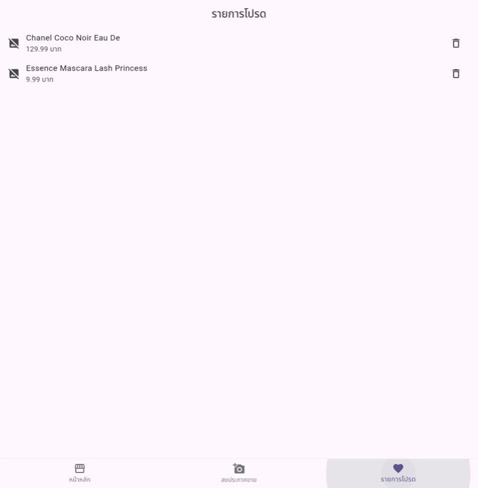

**หน้าร่างประกาศของฉัน** แสดงร่างได้ตามปกติ ไม่ต้องใช้เน็ตเลย


สรุป: ข้อมูลที่ผู้ใช้สร้างเอง (รายการโปรด ร่างประกาศ) อยู่ใน SQLite ในเครื่องจึงใช้งานได้แม้ไม่มีอินเทอร์เน็ต ส่วนข้อมูลที่มาจาก Server (รายการสินค้าหน้าหลัก รูปสินค้า) ยังต้องใช้เน็ต ถ้าจะให้หน้าหลักใช้งาน Offline ได้ด้วย ต้องเพิ่มการ Cache รายการสินค้าลงฐานข้อมูลหลังโหลดสำเร็จ แล้วให้ `ItemRepository` อ่านจาก Cache เมื่อเรียก API ไม่สำเร็จ

---

## ปัญหาที่พบบ่อยและวิธีแก้ไข (Troubleshooting)

**Error พูดถึง Class `ListingDraft` ชนกัน หรือ `The name 'ListingDraft' is defined in multiple libraries`** เกิดจากลืมใส่ `@DataClassName('ListingDraftRow')` บนตาราง `ListingDrafts` ใน `tables.dart` ตามที่เตือนไว้ใน Checkpoint 2.1 ทำให้ Drift สร้าง Class ชื่อ `ListingDraft` ซ้ำกับ Class เดิมจากสัปดาห์ที่ 7 ให้เพิ่ม Annotation นี้แล้วรัน `dart run build_runner build --delete-conflicting-outputs` ใหม่อีกครั้ง

**Error: `Target of URI hasn't been generated: 'app_database.g.dart'`** เกิดจากยังไม่ได้รันคำสั่ง `dart run build_runner build --delete-conflicting-outputs` หรือรันแล้วแต่มีข้อผิดพลาดระหว่างสร้างโค้ดที่ยังไม่ได้แก้ไข ให้ตรวจสอบผลลัพธ์ในเทอร์มินัลตอนรันคำสั่งนี้ให้ละเอียด มักมีข้อความบอกบรรทัดที่ผิดพลาดในไฟล์ `tables.dart`

**รัน `build_runner` แล้วค้างนานผิดปกติหรือ error ว่า `Conflicting outputs`** ให้ลองรันคำสั่ง `dart run build_runner clean` ก่อน แล้วค่อยรัน `dart run build_runner build --delete-conflicting-outputs` ใหม่อีกครั้ง

**`The named parameter 'favoritesRepository'/'draftRepository' isn't defined` ตอนแก้ `main_scaffold.dart`/`home_page.dart`/`sell_item_page.dart`** เกิดจากแก้ Constructor ของไฟล์หนึ่งแล้ว แต่ยังไม่ได้แก้จุดที่เรียกใช้ Widget นั้นให้ส่งพารามิเตอร์ใหม่ครบ ให้ไล่ตรวจทั้ง 3 ไฟล์ตามลำดับ: `main.dart` → `main_scaffold.dart` → `home_page.dart`/`sell_item_page.dart` ว่าชื่อพารามิเตอร์ตรงกันทุกจุด

**แอป Error ทันทีตอนเปิด บอกประมาณ `RangeError` หรือ Bottom Navigation Bar กับหน้าจอไม่ตรงกัน** เกิดจากจำนวนรายการใน List `pages` ของ `MainScaffold` ไม่เท่ากับจำนวน `BottomNavigationBarItem` (ต้องเป็น 3 รายการทั้งคู่หลังทำ Checkpoint 4.1) ให้ตรวจนับทั้งสองรายการให้ตรงกัน

**แอป Crash ด้วยข้อความเกี่ยวกับ `sqlite3` ตอนรันบน Android จริง** ตรวจสอบว่าเพิ่ม `sqlite3_flutter_libs` ใน `pubspec.yaml` ครบถ้วนแล้ว และรัน `flutter clean` ตามด้วย `flutter pub get` ใหม่อีกครั้งก่อนรันแอป

**ข้อมูลหายไปหลังแก้ไขโครงสร้างตาราง (เพิ่ม/ลบคอลัมน์)** เกิดจากไม่ได้เพิ่มค่า `schemaVersion` และเขียนโค้ด Migration รองรับ ตามที่เตือนไว้ในบทหนังสือเรียนหัวข้อ 8.4 ระหว่างพัฒนา (ยังไม่ปล่อยให้ผู้ใช้จริงใช้งาน) วิธีแก้ชั่วคราวที่ง่ายที่สุดคือถอนการติดตั้งแอปออกจากอุปกรณ์ทดสอบแล้วติดตั้งใหม่ เพื่อล้างไฟล์ฐานข้อมูลเก่าทิ้ง (ห้ามใช้วิธีนี้กับแอปที่ผู้ใช้จริงติดตั้งอยู่แล้ว)

**หน้า Favorites/My Drafts แสดงค้างที่ Loading ตลอด ไม่ขึ้นข้อมูล** มักเกิดจากลืมเรียก `setState()` หลังจากได้ผลลัพธ์จาก `await repository.getAllFavorites()`/`getAllDrafts()` กลับมา (โดยเฉพาะหลังกดลบแล้วต้องการให้ List รีเฟรช) ตรวจสอบตามรูปแบบเดียวกับที่แก้ปัญหานี้มาแล้วในสัปดาห์ที่ 6

**กดหัวใจที่หน้า Home แล้วไม่มีอะไรเกิดขึ้นเลย ไม่มี Error ด้วย** มักเกิดจากลืม `await` หน้า `addFavorite(...)` หรือลืมเขียนโค้ดแสดง `SnackBar` หลังเรียกสำเร็จ ให้ตรวจสอบว่าฟังก์ชันใน `onPressed` ประกาศเป็น `async` และมี `await` ก่อนเรียก `ScaffoldMessenger.of(context).showSnackBar(...)`

**กดหัวใจซ้ำที่สินค้าชิ้นเดิมแล้วแอป Error ด้วยข้อความเกี่ยวกับ `UNIQUE constraint failed`** เกิดจากลืมใส่ `mode: InsertMode.insertOrIgnore` ตอนเรียก `_db.into(_db.favoriteItems).insert(...)` ใน `addFavorite()` เพราะคอลัมน์ `itemId` ถูกกำหนดเป็น `.unique()` ไว้ใน `tables.dart` (Checkpoint 2.1) ทำให้ Insert ซ้ำ `itemId` เดิมไม่ได้ ให้เพิ่มพารามิเตอร์ `mode: InsertMode.insertOrIgnore` เข้าไปในคำสั่ง `.insert(...)`
